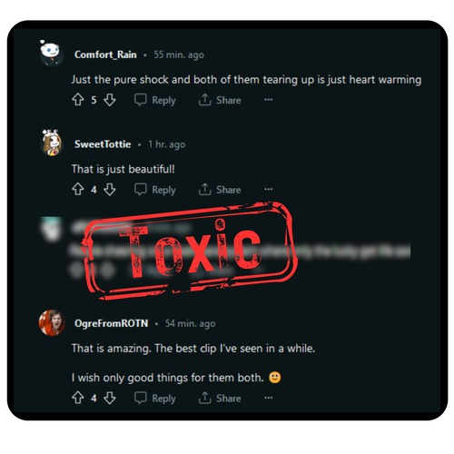

# Toxic Comment Classification with Transformers

In today's digital era, the Internet has unfortunately become a breeding ground for incivility and toxic comments, greatly exacerbated by the ability of users to post anonymously without facing consequences. Manual moderation of such comments is often impractical and time-consuming for platforms. Therefore, the primary goal of this project is to cultivate a safe online environment by empowering platforms to swiftly detect and remove toxic comments. This is achieved through the utilization of sentiment analysis on a dataset of toxic comments to assess their toxicity levels. The toxic comment dataset is used to evaluate and compare three classification models: Naïve Bayes, Transformer, and BERT. The results demonstrate the admirable performance of all three models in identifying and categorizing toxic comments, with the BERT model delivering the most optimal outcomes.
